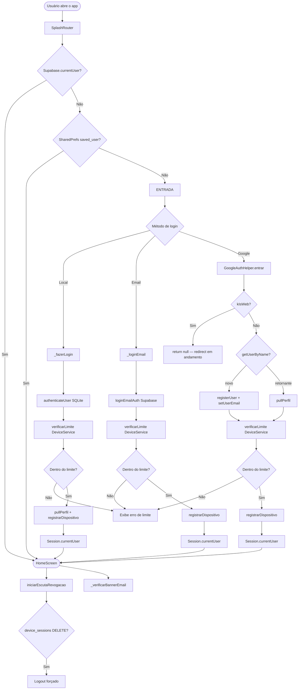
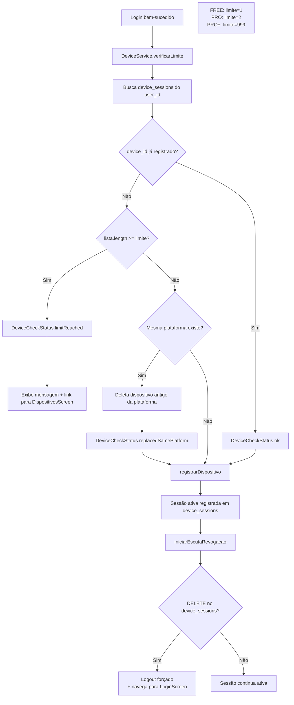
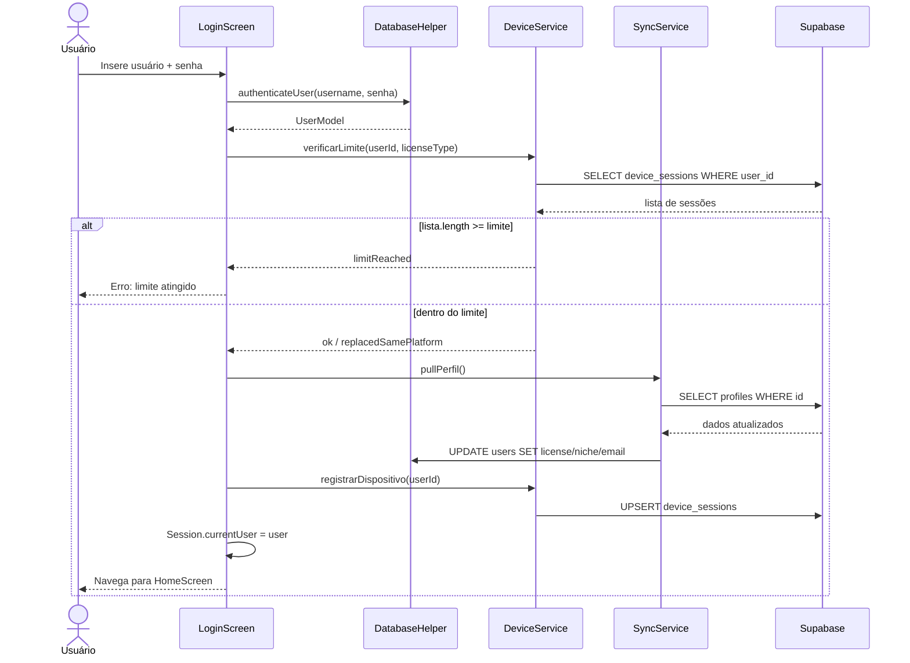
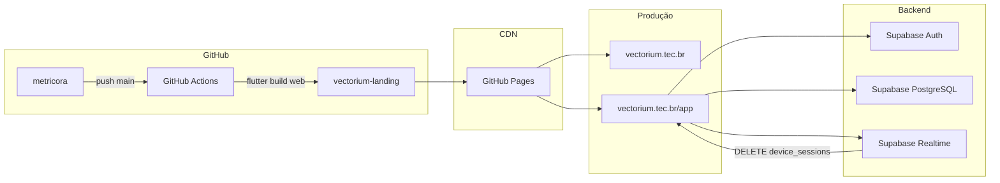

# UML — Vectorium / Metricora

**Versão:** 1.7  
**Data:** 2026-06-06

---

## 1. Diagrama de Classes — Arquitetura Central

```mermaid
classDiagram
    class UserModel {
        +int id
        +String username
        +String niche
        +String licenseType
        +bool isPro
    }
    class RegistroModel {
        +int id
        +int userId
        +double receita
        +double despesas
        +String produto
        +DateTime data
        +copyWithUserId(int) RegistroModel
        +fromSupabase(Map) RegistroModel$
    }
    class Session {
        +UserModel currentUser$
    }
    class DatabaseHelper {
        +instance$
        +registerUser(UserModel) Future~int~
        +getUserByName(String) Future~UserModel?~
        +getUserEmail(String) Future~String?~
        +setUserEmail(String, String) Future~void~
        +readRegistrosDoUsuario(userId) Future
        +getRegistrosPorPeriodo(userId, inicio, fim) Future
        +getEvolucaoMensal(userId, meses) Future
        +getMeta(userId, ano, mes) Future
        +saveMeta(userId, ano, mes) Future
        +create(RegistroModel) Future
    }
    class SupabaseService {
        +upsertProfile(username, licenseType, niche, email)$
        +registrarEmailAuth(email, senha, username, licenseType, niche)$
        +loginEmailAuth(email, senha)$
        +getUserProfile()$
    }
    class SyncService {
        +pullPerfil()$ Future~void~
        +listenRealtime(userId)$
        +stopRealtime()$
    }
    class GoogleAuthHelper {
        +disponivel$ bool
        +entrar(BuildContext) Future~UserModel?~
        +sair() Future~void~
    }
    class SupabaseBackupService {
        +fazerBackup()$ Future~BackupResult~
        +fazerRestore()$ Future~RestoreResult~
        +getInfoBackup()$ Future~BackupInfo~
    }
    class DeviceService {
        +verificarLimite(userId, licenseType)$ Future~DeviceCheckResult~
        +registrarDispositivo(userId)$ Future~void~
        +listarDispositivos()$ Future~List~
        +revogarDispositivo(deviceId)$ Future~void~
        +revogarDispositivoAtual()$ Future~void~
        +iniciarEscutaRevogacao(userId, onRevogado)$
        +pararEscutaRevogacao()$
        +deviceIdAtual()$ Future~String~
    }
    class DeviceCheckResult {
        +DeviceCheckStatus status
        +String errorMessage
        +String replacedDeviceName
        +bool bloqueado
    }
    class DeviceCheckStatus {
        <<enumeration>>
        ok
        replacedSamePlatform
        limitReached
    }
    class LoginScreen {
        -_fazerLogin()
        -_loginEmail()
        -_loginGoogle()
    }
    class HomeScreen {
        +initState()
        -_verificarOnboarding()
        -_verificarBannerEmail()
    }
    class DispositivosScreen {
        -_buildUsoCard()
        -_buildDeviceCard()
        -_revogar(deviceId)
    }
    class SplashRouter {
        -_resolver()
    }
    class LicenseManager {
        +bool isPro$
    }
    class GeminiService {
        +gerarAnaliseFinanceira(registros, nicho)$ Future
        +gerarCoachVendas(registros, nicho)$ Future
    }

    Session --> UserModel
    LoginScreen ..> DeviceService : verificarLimite
    LoginScreen ..> DeviceService : registrarDispositivo
    LoginScreen ..> SyncService : pullPerfil
    LoginScreen ..> SupabaseService : loginEmailAuth
    GoogleAuthHelper ..> DeviceService : verificarLimite
    GoogleAuthHelper ..> DeviceService : registrarDispositivo
    GoogleAuthHelper ..> DatabaseHelper : getUserByName / registerUser / setUserEmail
    GoogleAuthHelper ..> SyncService : pullPerfil
    HomeScreen ..> SyncService : listenRealtime / stopRealtime
    HomeScreen ..> DatabaseHelper : getUserEmail
    HomeScreen ..> DeviceService : iniciarEscutaRevogacao
    DispositivosScreen ..> DeviceService : listarDispositivos / revogarDispositivo
    SplashRouter ..> SupabaseService
    SplashRouter ..> DatabaseHelper
    SupabaseBackupService ..> DatabaseHelper
    SupabaseBackupService ..> RegistroModel
    DeviceService ..> DeviceCheckResult
    DeviceCheckResult --> DeviceCheckStatus
    LicenseManager --> UserModel

    note for DeviceService "kDeviceLimits: FREE=1, PRO=2, PRO+=999\nverificarLimite: limite total ANTES de substituição de plataforma"
    note for LoginScreen "Todo caminho de login chama\nverificarLimite antes de registrarDispositivo"
    note for SplashRouter "Resolve sessão (Supabase ou SharedPrefs)\nantes de renderizar qualquer tela"
```

---

## 2. Fluxo de Autenticação + Controle de Dispositivos

---

## 3. Fluxo de Controle de Dispositivos

---

## 4. Diagrama de Sequência — Login Local com Verificação de Dispositivo

---

## 5. Diagrama de Componentes — Infraestrutura

